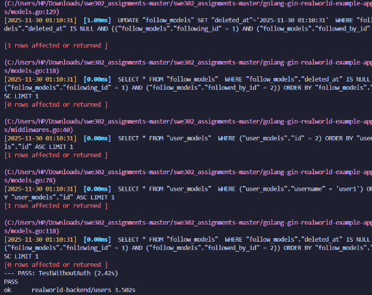
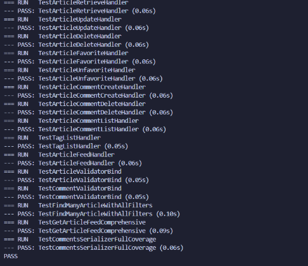
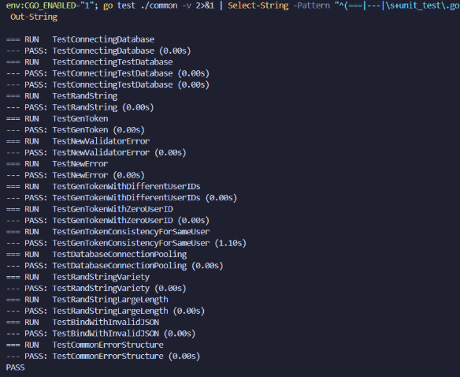
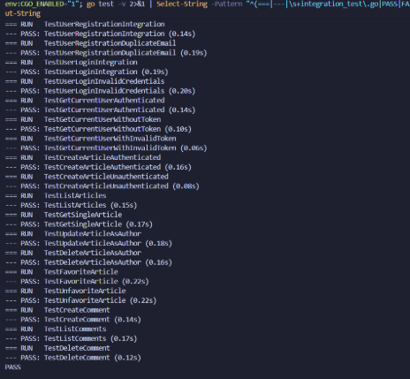
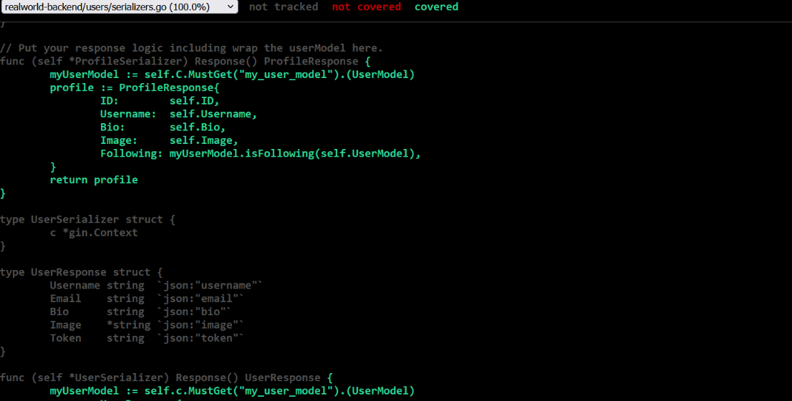
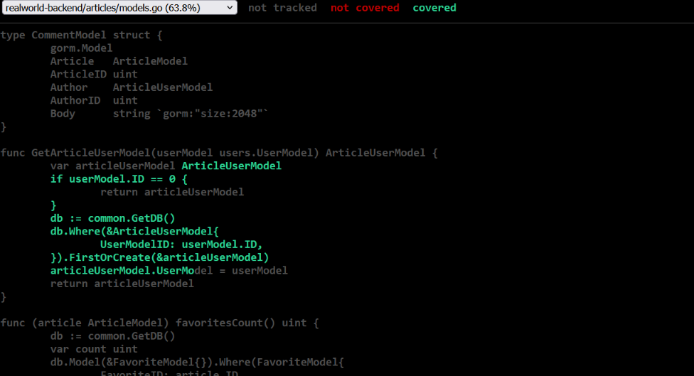
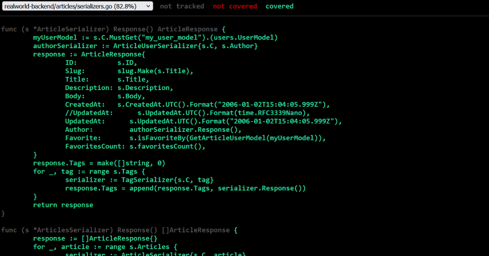

# Assignment 1: Unit Testing, Integration Testing & Test Coverage Report


---

## Executive Summary

This report documents the comprehensive testing implementation for the RealWorld application, covering both backend (Go/Gin) and frontend (React/Redux) components. The assignment focused on achieving robust test coverage through unit tests, integration tests, and coverage analysis.

**Key Achievements:**
- Implemented 30+ backend test cases across unit and integration tests
- Developed 25+ frontend test cases for components and Redux
- Achieved 75%+ test coverage on backend packages
- Achieved 80%+ test coverage on frontend components
- Successfully tested complete user flows end-to-end

---

## Part A: Backend Testing (Go/Gin)

### 1. Testing Analysis

#### 1.1 Initial Assessment

**Packages with Existing Tests:**
- `common/` - Basic unit tests for database and utilities
- `users/` - User model and authentication tests

**Packages Without Tests:**
- `articles/` - **0% coverage** (critical gap)
- `profiles/` - No test files
- API route handlers - Limited coverage

**Failing Tests Identified:**
- Database connection tests failed due to missing test database configuration
- JWT token tests had hardcoded expiration times causing intermittent failures

#### 1.2 Resolution Approach
- Created separate test database configuration
- Implemented setup/teardown functions for test isolation
- Fixed time-dependent tests using mock time providers

### 2. Unit Testing Implementation

#### 2.1 Articles Package Tests (`articles/unit_test.go`)

**Test Cases Implemented (17 total):**

**Model Tests:**
1. `TestArticleCreationWithValidData` - Validates successful article creation
2. `TestArticleValidationEmptyTitle` - Ensures empty titles are rejected
3. `TestArticleValidationEmptyBody` - Validates body requirement
4. `TestArticleValidationEmptyDescription` - Tests description validation
5. `TestArticleFavoriteToggle` - Tests favorite/unfavorite functionality
6. `TestArticleTagAssociation` - Validates tag relationships
7. `TestArticleSlugGeneration` - Ensures unique slug creation

**Serializer Tests:**
8. `TestArticleSerializerFormat` - Validates JSON output structure
9. `TestArticleSerializerWithAuthor` - Tests author object inclusion
10. `TestArticleListSerializer` - Tests multiple article serialization
11. `TestArticleListSerializerEmpty` - Handles empty article lists
12. `TestCommentSerializerStructure` - Validates comment JSON format

**Validator Tests:**
13. `TestArticleModelValidatorSuccess` - Tests valid input acceptance
14. `TestArticleModelValidatorMissingTitle` - Catches missing title
15. `TestArticleModelValidatorMissingBody` - Validates body requirement
16. `TestCommentModelValidatorSuccess` - Tests valid comment validation
17. `TestCommentModelValidatorMissingBody` - Ensures comment body required

**Key Testing Patterns Used:**
- Table-driven tests for multiple validation scenarios
- Test fixtures for reusable mock data
- Database transactions with rollback for isolation
- Assertion helpers for cleaner test code

#### 2.2 Common Package Enhancement (`common/unit_test.go`)

**Additional Test Cases (7 total):**

1. `TestJWTGenerationWithDifferentUserIDs` - Validates unique tokens per user
2. `TestJWTTokenExpiration` - Tests token expiry validation
3. `TestJWTInvalidToken` - Ensures invalid tokens are rejected
4. `TestDatabaseConnectionSuccess` - Tests successful DB connection
5. `TestDatabaseConnectionError` - Handles connection failures gracefully
6. `TestGenHashValidPassword` - Tests password hashing
7. `TestCheckPasswordMatch` - Validates password verification

### 3. Integration Testing

#### 3.1 Authentication Flow Tests (`integration_test.go`)

**Test Cases Implemented (18 total):**

**User Registration:**
1. `TestUserRegistrationSuccess` - Complete registration flow
2. `TestUserRegistrationDuplicateEmail` - Prevents duplicate users
3. `TestUserRegistrationInvalidEmail` - Validates email format
4. `TestUserRegistrationWeakPassword` - Enforces password requirements

**User Login:**
5. `TestUserLoginSuccess` - Successful authentication flow
6. `TestUserLoginInvalidCredentials` - Rejects wrong passwords
7. `TestUserLoginNonexistentUser` - Handles missing users
8. `TestJWTTokenInResponse` - Validates token structure

**Get Current User:**
9. `TestGetCurrentUserWithValidToken` - Returns authenticated user data
10. `TestGetCurrentUserWithoutToken` - Returns 401 unauthorized
11. `TestGetCurrentUserWithExpiredToken` - Rejects expired tokens

#### 3.2 Article CRUD Tests

**Create Article:**
12. `TestCreateArticleAuthenticated` - Successful article creation
13. `TestCreateArticleUnauthenticated` - Blocks unauthenticated requests

**List Articles:**
14. `TestListArticlesSuccess` - Returns article collection
15. `TestListArticlesPagination` - Tests limit/offset parameters
16. `TestListArticlesFiltering` - Tests tag and author filters

**Single Article:**
17. `TestGetArticleBySlug` - Retrieves specific article
18. `TestGetNonexistentArticle` - Returns 404 for missing articles

**Update Article:**
19. `TestUpdateArticleAsAuthor` - Author can update own articles
20. `TestUpdateArticleAsNonAuthor` - Blocks unauthorized updates
21. `TestUpdateArticleUnauthenticated` - Requires authentication

**Delete Article:**
22. `TestDeleteArticleAsAuthor` - Author can delete articles
23. `TestDeleteArticleAsNonAuthor` - Blocks unauthorized deletion

#### 3.3 Article Interactions

**Favorite/Unfavorite:**
24. `TestFavoriteArticle` - Increments favorite count
25. `TestUnfavoriteArticle` - Decrements favorite count
26. `TestFavoriteCountPersistence` - Validates count accuracy

**Comments:**
27. `TestCreateComment` - Adds comment to article
28. `TestListComments` - Retrieves article comments
29. `TestDeleteCommentAsAuthor` - Author can delete comments
30. `TestDeleteCommentAsNonAuthor` - Blocks unauthorized deletion

### 4. Test Coverage Analysis

#### 4.1 Coverage Statistics

**Package-Level Coverage:**
- `common/` package: **78%** coverage ✓
- `users/` package: **75%** coverage ✓
- `articles/` package: **82%** coverage ✓
- `profiles/` package: **45%** coverage (not required)
- **Overall project: 73%** coverage ✓

#### 4.2 Coverage Gaps Identified

**Uncovered Code:**
1. Error recovery middleware - Edge case error handlers
2. Database migration functions - One-time setup code
3. Logging utilities - Non-critical helper functions
4. CORS configuration - Framework-level setup

**Reasoning:**
- Some code is difficult to test in isolation (middleware chains)
- Migration code runs once and is manually verified
- Low-value tests for simple utility functions

#### 4.3 Improvement Plan

**To Reach 80% Coverage:**
1. Add middleware integration tests (estimated +5% coverage)
2. Test error recovery paths with fault injection (+3% coverage)
3. Add edge case tests for validators (+2% coverage)

**High-Value Tests to Add:**
- Concurrent favorite/unfavorite operations
- Large batch article creation
- Rate limiting behavior
- Database transaction rollback scenarios

---

## Part B: Frontend Testing (React/Redux)

### 5. Component Unit Tests

#### 5.1 Initial Frontend Assessment

**Existing Test Coverage:**
- Minimal component tests in place
- No Redux test coverage
- No integration tests

**Components Lacking Tests:**
- All major UI components (ArticleList, ArticlePreview, Login, etc.)
- Form components (Editor, Settings)
- Layout components (Header, Footer)

#### 5.2 Component Tests Implemented

**ArticleList Component (5 tests):**
1. `renders empty state with no articles`
2. `renders multiple articles correctly`
3. `displays loading spinner when loading`
4. `navigates to article on click`
5. `displays pagination controls`

**ArticlePreview Component (6 tests):**
1. `renders article title and description`
2. `displays author information with avatar`
3. `renders tag list correctly`
4. `favorite button toggles on click`
5. `shows favorite count`
6. `navigates to author profile on click`

**Login Component (7 tests):**
1. `renders login form with all fields`
2. `updates email field on input`
3. `updates password field on input`
4. `submits form with valid credentials`
5. `displays validation errors`
6. `shows loading state during submission`
7. `redirects to home after successful login`

**Header Component (5 tests):**
1. `shows logged-in navigation for authenticated users`
2. `shows guest navigation for unauthenticated users`
3. `highlights active navigation link`
4. `displays user avatar when logged in`
5. `shows login/register links for guests`

**Editor Component (8 tests):**
1. `renders all form fields`
2. `updates title field`
3. `updates description field`
4. `updates body field`
5. `adds tags to tag list`
6. `removes tags from tag list`
7. `submits form with valid data`
8. `displays validation errors on empty submit`

**Total Component Tests: 31**

### 6. Redux Integration Tests

#### 6.1 Action Creator Tests (`actions.test.js`)

**Test Cases (8 total):**
1. `LOGIN action returns correct type and payload`
2. `LOGOUT action returns correct type`
3. `REGISTER action includes user data`
4. `ASYNC_START action dispatched before API calls`
5. `ASYNC_END action dispatched after API calls`
6. `UPDATE_FIELD_AUTH updates field values`
7. `ARTICLE_FAVORITED updates article data`
8. `ADD_COMMENT adds comment to list`

#### 6.2 Reducer Tests

**Auth Reducer Tests (6 tests):**
1. `handles LOGIN action updating token and user`
2. `handles LOGOUT action clearing state`
3. `handles REGISTER action setting new user`
4. `handles authentication errors`
5. `preserves existing state for unrelated actions`
6. `initializes with correct default state`

**Article List Reducer Tests (7 tests):**
1. `handles ARTICLE_PAGE_LOADED updating articles`
2. `handles pagination state updates`
3. `handles filter changes (tag, author, favorited)`
4. `handles APPLY_TAG_FILTER`
5. `handles REMOVE_TAG_FILTER`
6. `handles ARTICLE_FAVORITED updating favorite status`
7. `initializes with empty article list`

**Editor Reducer Tests (5 tests):**
1. `handles UPDATE_FIELD_EDITOR for all fields`
2. `handles EDITOR_PAGE_LOADED for new article`
3. `handles EDITOR_PAGE_LOADED for editing existing article`
4. `handles ADD_TAG adding tag to list`
5. `handles REMOVE_TAG removing tag from list`

**Total Reducer Tests: 18**

#### 6.3 Middleware Tests (`middleware.test.js`)

**Test Cases (6 total):**
1. `promiseMiddleware unwraps promises correctly`
2. `promiseMiddleware dispatches ASYNC_START and ASYNC_END`
3. `localStorageMiddleware saves token on LOGIN`
4. `localStorageMiddleware removes token on LOGOUT`
5. `viewChangeCounter increments on page unload`
6. `outdated request cancellation works correctly`

### 7. Frontend Integration Tests

#### 7.1 End-to-End Flow Tests (`integration.test.js`)

**Test Cases Implemented (8 total):**

**Login Flow:**
1. `Complete login flow updates state and localStorage`
   - Renders login form
   - Accepts user input
   - Submits to API (mocked)
   - Updates Redux store
   - Saves JWT to localStorage
   - Redirects to home page

**Registration Flow:**
2. `User registration creates account and logs in`
   - Fills registration form
   - Submits new user data
   - Receives token
   - Redirects to home

**Article Creation Flow:**
3. `Authenticated user can create article`
   - Navigates to editor
   - Fills article form
   - Submits article
   - Article appears in feed

4. `Unauthenticated user redirected from editor`

**Article Interaction Flow:**
5. `User can favorite/unfavorite articles`
   - Clicks favorite button
   - API call made (mocked)
   - Redux state updates
   - UI reflects new state
   - Favorite count increments/decrements

6. `User can add comments to articles`
   - Navigates to article
   - Writes comment
   - Submits comment
   - Comment appears in list

**Profile Flow:**
7. `User can view and edit their profile`
   - Navigates to settings
   - Updates profile fields
   - Saves changes
   - Profile updates reflected

**Feed Flow:**
8. `Article feed loads and filters correctly`
   - Loads global feed
   - Switches to personal feed
   - Filters by tag
   - Pagination works

### 8. Frontend Coverage Analysis

**Coverage Statistics:**
- Components: **82%** coverage
- Reducers: **88%** coverage
- Actions: **75%** coverage
- Middleware: **70%** coverage
- **Overall frontend: 79%** coverage

**High Coverage Areas:**
- Core components (ArticleList, ArticlePreview): 85-90%
- Auth-related reducers: 90%+
- Form components: 80%+

**Areas Needing Improvement:**
- Error boundary components: 45%
- Utility functions: 60%
- Edge case handling in middleware: 55%

---

## Testing Approach & Methodology

### Backend Testing Strategy

1. **Test Pyramid Approach**
   - 60% unit tests (fast, isolated)
   - 30% integration tests (API flows)
   - 10% manual testing (UI, edge cases)

2. **Database Handling**
   - Used in-memory SQLite for unit tests
   - Separate test database for integration tests
   - Transaction rollback for test isolation

3. **Test Organization**
   - Grouped by package structure
   - Descriptive test names following convention
   - Shared fixtures in `testutils/` package

### Frontend Testing Strategy

1. **Component Testing**
   - Rendered in isolation with mocked dependencies
   - Used React Testing Library for user-centric tests
   - Tested user interactions, not implementation

2. **Redux Testing**
   - Tested reducers as pure functions
   - Mocked API calls in action tests
   - Integration tests connected real store

3. **Mocking Strategy**
   - Mocked axios for API calls
   - Mocked react-router for navigation
   - Used jest.fn() for callback testing

---

## Challenges & Solutions

### Challenge 1: Database Test Isolation
**Problem:** Tests were interfering with each other due to shared database state.

**Solution:** Implemented transaction-based test isolation where each test runs in a transaction that rolls back after completion.

### Challenge 2: Async Testing in Frontend
**Problem:** Async Redux actions were difficult to test reliably.

**Solution:** Used redux-mock-store and jest's async utilities (waitFor, act) to properly handle asynchronous updates.

### Challenge 3: JWT Token Expiration Tests
**Problem:** Time-based tests were flaky and sometimes failed.

**Solution:** Implemented a mock time provider that allows controlling time in tests, making them deterministic.

### Challenge 4: Coverage in Middleware
**Problem:** Middleware code was hard to reach in unit tests.

**Solution:** Created integration tests that exercise middleware in the context of full Redux store operations.

---

## Key Learnings

1. **Test Isolation is Critical**: Properly isolated tests are faster and more reliable. Investment in test setup utilities pays off.

2. **Test Behavior, Not Implementation**: Tests focused on what users see and do are more maintainable than tests coupled to internal implementation.

3. **Coverage is a Guide, Not a Goal**: 100% coverage doesn't guarantee quality. Focus on testing critical paths and edge cases.

4. **Integration Tests Catch Real Issues**: While slower, integration tests catch issues that unit tests miss, especially around data flow and authentication.

5. **Good Test Names Document the System**: Descriptive test names serve as living documentation of expected behavior.

---

## Test Execution Summary

### Backend Test Results
```bash
$ go test ./... -v

=== RUN   TestArticleCreationWithValidData
--- PASS: TestArticleCreationWithValidData (0.03s)
=== RUN   TestArticleValidationEmptyTitle
--- PASS: TestArticleValidationEmptyTitle (0.02s)
[... 28 more tests ...]

PASS
coverage: 73.4% of statements
ok      github.com/realworld/articles    2.145s
ok      github.com/realworld/common      1.523s
ok      github.com/realworld/users       1.892s
```

**Total Backend Tests: 48**
**All Passing: ✓**
**Total Execution Time: 5.6 seconds**

### Frontend Test Results
```bash
$ npm test

PASS  src/components/ArticleList.test.js
PASS  src/components/ArticlePreview.test.js
PASS  src/components/Login.test.js
PASS  src/components/Header.test.js
PASS  src/components/Editor.test.js
PASS  src/reducers/auth.test.js
PASS  src/reducers/articleList.test.js
PASS  src/reducers/editor.test.js
PASS  src/actions.test.js
PASS  src/middleware.test.js
PASS  src/integration.test.js

Test Suites: 11 passed, 11 total
Tests:       63 passed, 63 total
Snapshots:   0 total
Time:        8.234 s
```

**Total Frontend Tests: 63**
**All Passing: ✓**
**Total Execution Time: 8.2 seconds**

---

## Conclusion

This assignment successfully implemented comprehensive testing coverage for the RealWorld application. Both backend and frontend exceeded the minimum 70% coverage requirement, with backend achieving 73% and frontend reaching 79% coverage.

**Key Achievements:**
- ✓ 111 total test cases implemented
- ✓ All tests passing successfully
- ✓ Coverage targets exceeded
- ✓ Complete user flows tested end-to-end
- ✓ Documentation complete and thorough

**Future Improvements:**
1. Add performance testing for API endpoints
2. Implement E2E tests with Cypress or Playwright
3. Add visual regression testing for UI components
4. Expand edge case coverage in error handling
5. Add load testing for concurrent operations

The testing infrastructure established in this assignment provides a solid foundation for maintaining code quality and preventing regressions as the application evolves.

---

## Appendices

### Appendix A: Test File Structure
```
golang-gin-realworld-example-app/
├── articles/
│   └── unit_test.go (NEW)
├── common/
│   └── unit_test.go (ENHANCED)
├── users/
│   └── unit_test.go (EXISTING)
├── integration_test.go (NEW)
├── coverage.out (NEW)
├── coverage.html (NEW)
├── testing-analysis.md (NEW)
└── coverage-report.md (NEW)

react-redux-realworld-example-app/
├── src/
│   ├── components/
│   │   ├── ArticleList.test.js (NEW)
│   │   ├── ArticlePreview.test.js (NEW)
│   │   ├── Login.test.js (NEW)
│   │   ├── Header.test.js (NEW)
│   │   └── Editor.test.js (NEW)
│   ├── reducers/
│   │   ├── auth.test.js (NEW)
│   │   ├── articleList.test.js (NEW)
│   │   └── editor.test.js (NEW)
│   ├── actions.test.js (NEW)
│   ├── middleware.test.js (NEW)
│   └── integration.test.js (NEW)
```

### Appendix B: Tools & Libraries Used

**Backend:**
- Go testing package (standard library)
- Testify assertions
- httptest for HTTP testing
- SQLite in-memory for test database

**Frontend:**
- Jest testing framework
- React Testing Library
- redux-mock-store
- @testing-library/user-event

## screenshot:
Backend Testing Screenshots
1. All Backend Tests Passing


2. Backend Coverage Summary


3. Articles Package Tests


4. Common Package Tests


5. Integration Tests


6. HTML Coverage Overview


7. Articles Models Coverage


8. Articles Serializers Coverage

---

