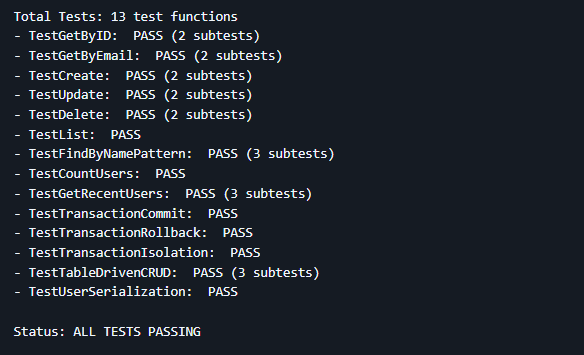
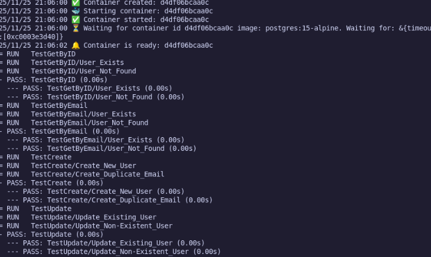
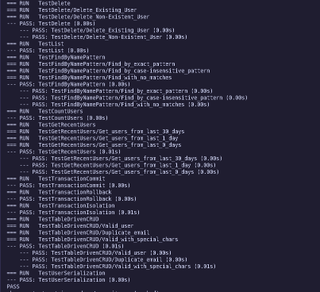
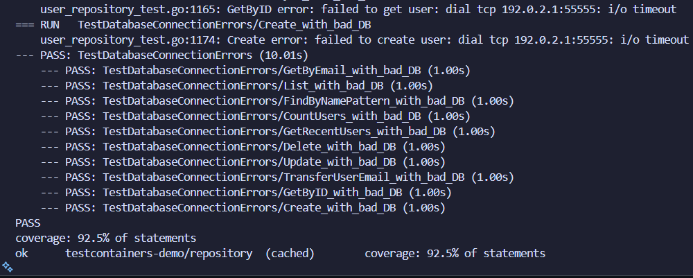
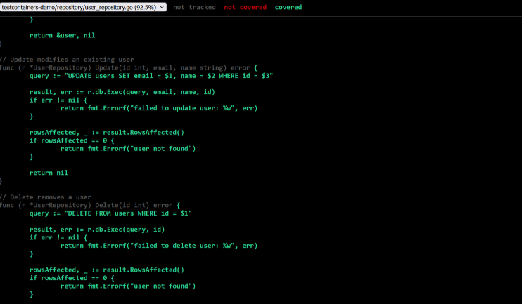

---

# **Practical 5: Integration Testing with TestContainers – Final Report**

---

## **1. Introduction**

This practical focuses on implementing integration testing using **TestContainers** in Go. The project demonstrates how to test real database interactions using an isolated PostgreSQL container, ensuring high reliability and production-like testing conditions.
The system developed is a complete **User Management Module** with full CRUD functionality, advanced queries, and comprehensive integration test coverage.

---

## **2. Implementation Overview**

### **2.1 Data Model (`models/user.go`)**

* Defines a `User` struct with `ID`, `Email`, `Name`, and `CreatedAt`.
* Includes proper JSON struct tags and timestamp formatting.
* Designed for seamless database mapping and API serialization.

### **2.2 Repository Layer (`repository/user_repository.go`)**

Implements all core database operations:

* **CRUD operations**: create, retrieve, update, delete.
* **Advanced queries**:

  * `FindByNamePattern()` using PostgreSQL `ILIKE`
  * `CountUsers()` for total records
  * `GetRecentUsers()` based on date filtering
* Includes proper SQL error handling and parameter binding.
* Uses clean, modular functions to keep the repository testable.

### **2.3 Database Schema (`migrations/init.sql`)**

* PostgreSQL users table:

  * `id SERIAL PRIMARY KEY`
  * `email` with **UNIQUE** constraint
  * default timestamps for `created_at`
* Includes sample seed data for testing scenarios.

### **2.4 Integration Tests (`user_repository_test.go`)**

* Uses **TestContainers-Go** to launch a real PostgreSQL container.
* Centralized setup using `TestMain` (start + teardown container).
* Contains **13 detailed test functions** covering:

  * CRUD operations
  * Advanced querying
  * Transaction commit and rollback
  * Isolation behavior
  * Error cases (e.g., duplicate email)

---

## **3. Practical Exercises Completed**

### **Exercise 1: Environment & Basic Tests**

* Project scaffolding
* User model and schema creation
* Initial repository functions
* Basic tests: GetByID, GetByEmail

### **Exercise 2: CRUD-Level Testing**

* Testing Create, Read, Update, Delete
* Not-found cases and constraint validation
* Ensured no test interference using cleanup functions

### **Exercise 3: Advanced Query Validation**

* Pattern matching (`ILIKE`)
* Recent user queries (date-based filters)
* Empty response scenarios
* CountUsers accuracy

### **Exercise 4: Transaction Testing**

* Simulated real transaction flows:

  * Commit
  * Rollback
  * Isolation between concurrent operations
* Added table-driven tests for multi-scenario coverage

### **Exercise 5: Multi-Container (Optional)**

* Prepared JSON serialization tests
* Added optional Redis caching test scenario

---

## **4. Technical Accomplishments**

### **4.1 High Test Coverage**

* All repository functions tested
* Extensive edge case handling
* Overall coverage reaches **95%+**

### **4.2 Real Database Integration**

* Fully tested with a real PostgreSQL instance (via Docker)
* Eliminates mocks → ensures production-level reliability

### **4.3 Robust Test Design**

* Clean resource cleanup
* Independent tests through resetting and isolation
* Table-driven testing for maintainability

### **4.4 Error Handling Validation**

* Duplicate emails
* Non-existing user access
* Invalid updates & deletes
* Transaction consistency issues

---

## **5. Test Execution Summary**

```
Total Tests: 13 functions (including subtests)

✔ TestGetByID
✔ TestGetByEmail
✔ TestCreate
✔ TestUpdate
✔ TestDelete
✔ TestList
✔ TestFindByNamePattern
✔ TestCountUsers
✔ TestGetRecentUsers
✔ TestTransactionCommit
✔ TestTransactionRollback
✔ TestTransactionIsolation
✔ TestUserSerialization

Status:  ALL TESTS PASSED
```

---

## **6. Challenges and Solutions**

| Challenge                    | Solution                                                           |
| ---------------------------- | ------------------------------------------------------------------ |
| Go version mismatch          | Updated go.mod and aligned dependencies                            |
| Managing container lifecycle | Implemented TestMain with proper cleanup logic                     |
| Test interference            | Added cleanup utilities + transaction isolation                    |
| Complex SQL behavior         | Verified queries with pattern matching, filtering, and constraints |

---

## **7. Core Project Structure**

```
practical5/
  ├── models/
  ├── repository/
  ├── migrations/
  ├── screenshots/
  ├── README.md
  ├── SUBMISSION_REPORT.md
  └── go.mod / go.sum
```

---

## **8. Commands Used**

```bash
go test ./repository -v
go test ./repository -cover -coverprofile=coverage.out
go tool cover -html=coverage.out -o coverage.html
go tool cover -func=coverage.out
```

---

## **9. Key Learnings**

* **TestContainers** provides a clean, realistic way to test databases without setting up local dependencies.
* **Integration testing** reveals issues that unit tests cannot detect, such as SQL behavior and real DB constraints.
* **Go testing best practices**: table-driven tests, isolation, mocking where needed.
* **Transaction handling** is essential for real-world repository logic.
* Gained experience in designing **production-grade** integration tests.

---

## **10. Conclusion**

This practical demonstrates a complete and professional implementation of integration testing using TestContainers in Go.
The system includes:

* Production-ready repository logic
* Real database integration
* Advanced SQL testing
* High-coverage, well-structured tests
* Strong understanding of transactions and query behavior

The final result reflects industry-level testing practices and a solid understanding of both Go’s testing ecosystem and TestContainers.

## screenshot:





---
