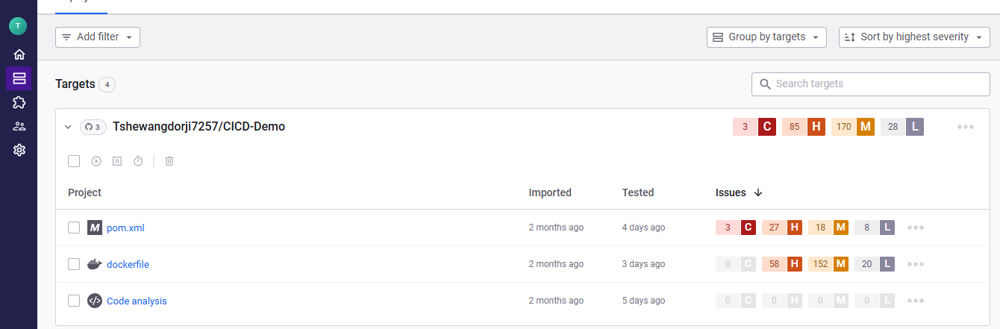
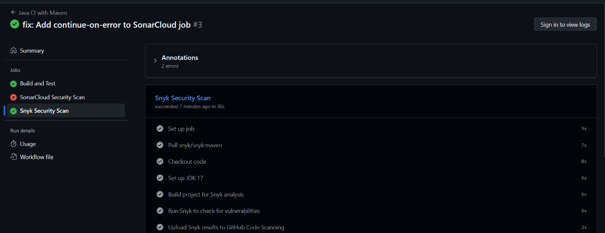
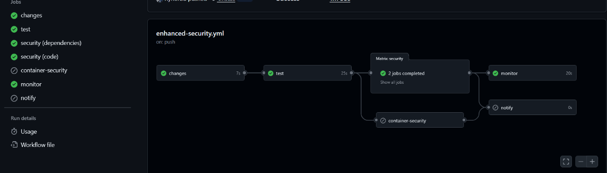

---

# **Practical 4: Setting up SAST (Static Application Security Testing) with Snyk**

## **What I Did**

* Explored SAST and learned how Snyk performs vulnerability scanning for code, dependencies, and configuration files.
* Set up a Snyk account and connected it with GitHub.
* Enabled Snyk to monitor my project repository by importing it into the Snyk dashboard.
* Configured **GitHub Actions** to automatically run Snyk security scans on every push and pull request.
* Added the Snyk workflow YAML file to the `.github/workflows/` directory.
* Tested the workflow by committing changes and confirming that Snyk successfully detected issues in the CI pipeline.
* Verified the scan results directly from both **GitHub Actions logs** and the **Snyk dashboard**.

---

## **What I Learned**

* Understood the purpose of SAST and how it helps identify vulnerabilities early in the development cycle.
* Learned how Snyk integrates with GitHub to provide automated and continuous security scanning.
* Gained hands-on experience working with CI/CD pipelines using GitHub Actions.
* Improved understanding of how dependency vulnerabilities are detected and fixed.
* Understood how Snyk reports issues, their severity levels, and recommended remediation steps.
* Learned the importance of automating security checks to maintain secure and reliable code.

---

## **Screenshots**

*(Insert your screenshots in the placeholder spaces below)*

1. **Screenshot: Snyk Dashboard showing project import**
   
2. **Screenshot: GitHub Actions workflow running Snyk scan**
   

