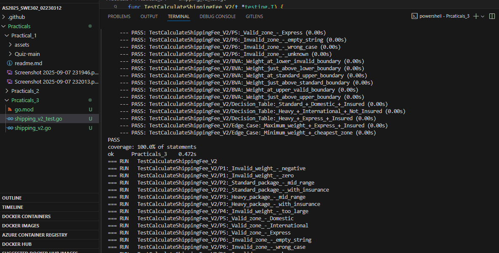

# Software Testing Practical 3 - Analysis and Implementation

## Student Analysis

---

## Part 1: Equivalence Partitioning

### Weight Partitions
- **P1: Invalid (Too Small) - weight ≤ 0**  
  - Examples: `-10, -1, 0`  
  - Why: Weight must be greater than 0, so any weight ≤ 0 should trigger an error  

- **P2: Standard Package - 0 < weight ≤ 10**  
  - Examples: `0.1, 5, 10`  
  - Why: Weights in this range are "Standard" packages with no heavy surcharge  

- **P3: Heavy Package - 10 < weight ≤ 50**  
  - Examples: `10.1, 25, 50`  
  - Why: Weights > 10kg and ≤ 50kg are "Heavy" packages that incur a $7.50 surcharge  

- **P4: Invalid (Too Large) - weight > 50**  
  - Examples: `50.1, 100, 1000`  
  - Why: Weights > 50kg are invalid and should produce an error  

### Zone Partitions
- **P5: Valid Zones** – `{"Domestic", "International", "Express"}`  
  - Why: These are the exact valid strings specified  

- **P6: Invalid Zones** – Any other string  
  - Examples: `"Local", "", "domestic", "DOMESTIC", "Unknown"`  
  - Why: Specification requires exact matches, so deviations trigger an error  

### Insured Partitions
- **P7: Insured = true**  
  - Why: Adds 1.5% of `(base fee + heavy surcharge)`  

- **P8: Not Insured = false**  
  - Why: No insurance cost added  

---

## Part 2: Boundary Value Analysis

- **Lower Boundary (around 0)**  
  - `0`: Last invalid value (should error)  
  - `0.1`: First valid value (standard package)  
  - Why: Off-by-one errors often occur at this transition  

- **Mid Boundary (around 10)**  
  - `10`: Last standard package (no surcharge)  
  - `10.1`: First heavy package (surcharge applies)  
  - Why: Critical to test surcharge logic  

- **Upper Boundary (around 50)**  
  - `50`: Last valid value (works)  
  - `50.1`: First invalid value (error)  
  - Why: Tests the upper limit of valid inputs  

---

## Part 3: Test Case Design Strategy

My test cases cover:
- All **equivalence partitions**
- All **boundary values**
- **Combination testing** (weight tiers × zones × insurance)  
- **Error conditions** (invalid inputs)  

---

## Key Calculations Used

**Formula:**  
`Final Fee = (Base Fee + Heavy Surcharge) + Insurance Cost`

- Base Fees:
  - Domestic: `$5.00`
  - International: `$20.00`
  - Express: `$30.00`

- Heavy Surcharge: `$7.50` (only when weight > 10kg)  
- Insurance: `1.5% × (Base Fee + Heavy Surcharge)` if insured = true  

### Example Calculations
- `5kg, Domestic, Not Insured` → $5.00  
- `15kg, International, Not Insured` → $20.00 + $7.50 = **$27.50**  
- `15kg, International, Insured` → $27.50 + (27.50 × 0.015) = **$27.91**  

---

This systematic approach ensures comprehensive coverage while minimizing redundant test cases.

