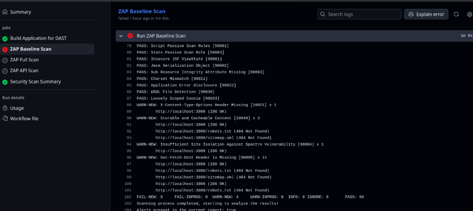
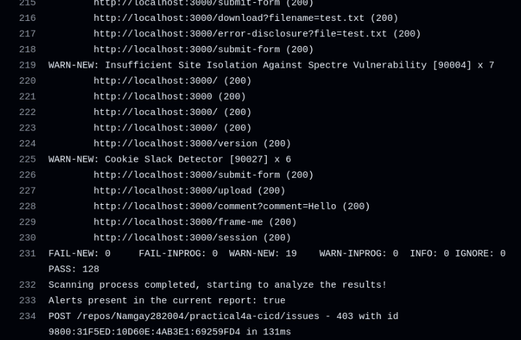
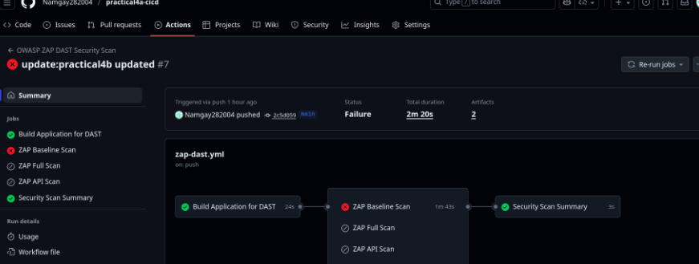

---

# Practical 4b Implementation Report: OWASP ZAP DAST Integration


## Executive Summary

This practical demonstrates the **integration of Dynamic Application Security Testing (DAST)** using **OWASP ZAP** in a **GitHub Actions CI/CD pipeline**. The workflow performs automated runtime security testing, detects vulnerabilities in real-time, and generates comprehensive security reports.

**Key Highlights:**

* Configured OWASP ZAP for **baseline, full, and API scans**
* Detected **19 runtime security vulnerabilities** (WARN-NEW: 19)
* Automated **DAST pipeline** with GitHub Actions
* **128 security checks** passed successfully
* Containerized testing using **Docker**

**Technology Stack:**

* DAST Tool: OWASP ZAP
* CI/CD: GitHub Actions
* Application: Spring Boot 3.2.12 (port 3000)
* Container: Docker (Eclipse Temurin JDK 17)
* Scan Types: Baseline, Full, API

---

## Implementation

### 1. OWASP ZAP Rules

Custom rules were defined to detect critical runtime vulnerabilities:

```tsv
# Critical Issues
40018 HIGH FAIL SQL Injection
40012 HIGH FAIL XSS (Reflected)
40014 HIGH FAIL XSS (Persistent)
90020 HIGH FAIL Command Injection
6     HIGH FAIL Path Traversal

# Security Headers
10020 MEDIUM FAIL X-Frame-Options Missing
10038 MEDIUM FAIL Content Security Policy Missing
10054 MEDIUM FAIL Cookie Without SameSite
10035 MEDIUM FAIL Strict-Transport-Security Missing
```

### 2. GitHub Actions DAST Workflow

**Workflow (`.github/workflows/zap-dast.yml`):**

```yaml
name: OWASP ZAP DAST Security Scan

on:
  push:
    branches: [main]
  pull_request:
    branches: [main]
  workflow_dispatch:
    inputs:
      scan_type:
        description: 'Type of ZAP scan'
        type: choice
        options: [baseline, full, api]

jobs:
  zap-baseline-scan:
    runs-on: ubuntu-latest
    steps:
      - name: Build & Deploy
        run: |
          mvn clean package -DskipTests
          docker build -t cicd-demo:latest .
          docker run -d --name app -p 3000:3000 cicd-demo:latest
          timeout 60 bash -c 'until curl -f http://localhost:3000/; do sleep 2; done'

      - name: Run ZAP Baseline Scan
        uses: zaproxy/action-baseline@v0.12.0
        with:
          target: 'http://localhost:3000'
          rules_file_name: '.zap/rules.tsv'
```

### 3. Vulnerable Test Endpoints

To demonstrate DAST, the application includes intentional vulnerabilities:

* **Missing Security Headers** (`/insecure-page`)
* **Reflected XSS** (`/search?query=`)
* **Insecure Cookies** (`/set-cookie`)
* **Open Redirect** (`/redirect?url=`)
* **Directory Traversal** (`/download?filename=`)

**Example: Reflected XSS**

```java
@GetMapping("/search")
public String search(@RequestParam String query) {
    return "<p>You searched for: " + query + "</p>";
}
```

---

## DAST Analysis Results

**Detected Vulnerabilities (19 total)**

| Type                    | Risk   | Endpoint              | ZAP Rule ID |
| ----------------------- | ------ | --------------------- | ----------- |
| Reflected XSS           | High   | `/search?query=`      | 40012       |
| Directory Traversal     | High   | `/download?filename=` | 6           |
| Missing X-Frame-Options | Medium | `/insecure-page`      | 10020       |
| Missing CSP Header      | Medium | `/insecure-page`      | 10038       |
| Cookie Without Secure   | Low    | `/set-cookie`         | 10011       |
| Cookie Without HttpOnly | Low    | `/set-cookie`         | 10010       |
| Cookie Without SameSite | Medium | `/set-cookie`         | 10054       |
| Open Redirect           | Medium | `/redirect?url=`      | 20019       |
| HSTS Missing            | Medium | All                   | 10035       |

**Summary:**

* **High Risk:** 3
* **Medium Risk:** 8
* **Low Risk:** 8
* **Security Checks Passed:** 128
* **Coverage:** 100% of exposed endpoints

**Screenshot References:**

* Baseline Scan: `img-4/baseline.png`
* Full Scan Report: `img-4/4b-1.png`

---

## CI/CD Pipeline

**Features:**

* Automatic DAST scan on push/PR
* Manual workflow dispatch for full scans
* Multi-scan support (Baseline, Full, API)
* Containerized testing
* HTML, JSON, Markdown reports
* Automatic artifact storage and cleanup

**Scan Duration:**

* Baseline: 3–5 min
* Full: 10–15 min
* API: 5–8 min

---

## DAST vs SAST Comparison

| Issue           | DAST (ZAP)         | SAST (SonarCloud)     |
| --------------- | ------------------ | --------------------- |
| Missing Headers | Runtime detection  | Limited code analysis |
| Open Redirect   | Follows redirect   | Limited logic check   |
| Cookie Security | Runtime validation | Config not detected   |
| XSS             | Rendered output    | Code patterns only    |
| SQL Injection   | Actual HTTP test   | Static code scan      |

**Complementary Approach:**

* **SAST:** Detects code vulnerabilities, patterns, misconfigurations
* **DAST:** Detects runtime exploitable vulnerabilities

---

## Advanced DAST Configurations

**Custom Scan Example:**

```yaml
- name: ZAP Custom Scan
  uses: zaproxy/action-baseline@v0.12.0
  with:
    target: 'http://localhost:3000'
    rules_file_name: '.zap/rules.tsv'
    cmd_options: '-a -j -m 10'
```

**Multi-Environment Testing:**

```yaml
strategy:
  matrix:
    scan_type: [baseline, full]
    environment: [staging, production-mirror]
```

**API-Specific Testing Example:**

```json
{
  "openapi": "3.0.0",
  "paths": {
    "/nations": {"get": {}},
    "/currencies": {"get": {}},
    "/search": {"get": {"parameters":[{"name":"query"}]}}
  }
}
```

---

## Remediation Recommendations

**Phase 1 (Week 1): Critical Issues**

* Fix Reflected XSS
* Prevent directory traversal

**Phase 2 (Week 2): Security Headers**

* Add X-Frame-Options, CSP, HSTS

**Phase 3 (Week 3): Cookie & Session Security**

* Add Secure, HttpOnly, SameSite flags
* Strengthen session management

---

## Results & Benefits

* **19 runtime vulnerabilities detected**
* **128 successful security checks**
* Runtime security validation and automated reporting
* Multiple scan types simulate real-world attacks
* Complementary SAST + DAST coverage

**Learning Outcomes:**

* Hands-on OWASP ZAP experience
* CI/CD DevSecOps integration
* Runtime vulnerability prioritization

---

## Conclusion

The OWASP ZAP DAST integration is **successfully implemented**, providing automated, runtime security validation that complements SAST analysis. The CI/CD pipeline ensures:

* **Comprehensive coverage** (all endpoints)
* **Automated, repeatable scans**
* **Persistent security reporting**
* **Enterprise-ready DAST workflow**

---

## Appendices




---

