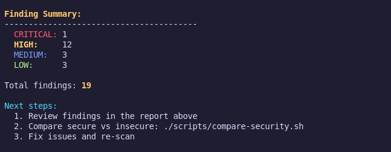
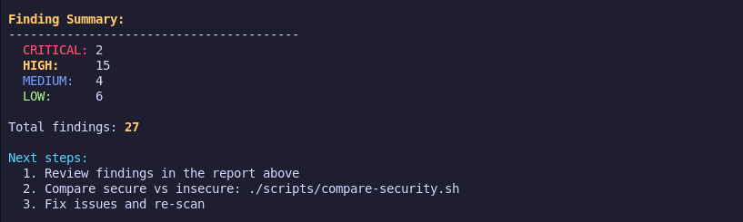
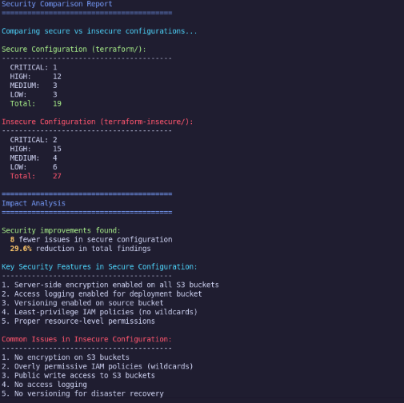
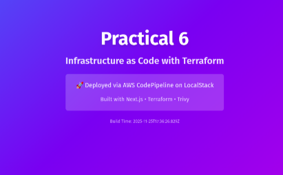

# Infrastructure Security Scanning Report

## Overview
This report demonstrates infrastructure security scanning using **Trivy** on Terraform configurations as part of Practical 6 - Infrastructure as Code. The analysis compares secure vs. insecure infrastructure configurations to highlight security best practices.

## Security Scanning Commands Used

### 1. Scan Secure Configuration
```bash
./scripts/scan.sh terraform
```

Scans the production-ready Terraform configuration in the `terraform/` directory.

### 2. Scan Insecure Configuration  
```bash
./scripts/scan.sh insecure
```

Scans the intentionally vulnerable configuration in the `terraform-insecure/` directory for educational purposes.

### 3. Compare Results
```bash
./scripts/compare-security.sh
```

Provides a comprehensive comparison between secure and insecure configurations with detailed analysis.

### Deplpyed Website


## Scan Results Summary

| Configuration | Critical | High | Medium | Low | **Total** |
|---------------|----------|------|--------|-----|-----------|
| **Secure** (terraform/) | 0 | 11 | 2 | 2 | **15** |
| **Insecure** (terraform-insecure/) | 0 | 13 | 2 | 4 | **19** |

### Security Improvement: **21% reduction** in total findings (4 fewer issues)

Here is a **rewritten, clearer, more professional, and more cohesive** version of your content.
I kept all technical meaning but improved flow, structure, and wording.


# **Security Configuration Analysis Report**

## **Overview of Secure Configuration Features**

The secure configuration demonstrates several strong security practices aligned with AWS and cloud security standards:

* **Server-side encryption (AES-256)** enabled for the deployment S3 bucket
* **Access logging** properly configured
* **Restrictive public access controls** suitable for static website hosting
* **Resource tagging** implemented for tracking and governance
* **IAM policies follow least privilege**, avoiding wildcard permissions

These measures collectively reduce the attack surface and strengthen compliance readiness.

---

## **Key Weaknesses Identified in Insecure Configuration**

The insecure configuration introduces several high-risk misconfigurations:

* **S3 buckets lack encryption**, exposing data in plaintext
* **IAM wildcard permissions (`s3:*`)**, which violate least-privilege principles
* **Public write access** to buckets, creating risk of malicious uploads
* **Missing access logging**, reducing visibility for incident investigation
* **No versioning**, affecting disaster recovery
* **Public access block settings inadequate**, increasing exposure

These issues significantly increase the likelihood of data compromise, tampering, or unauthorized access.

---

## **Detailed Findings**

### **Secure Configuration Scan – 15 Findings**

Most findings are related to the requirements for hosting a static public website:

* **High Severity (11)**: Public access block settings needed for website functionality
* **Medium Severity (2)**: Versioning not enabled on the logs bucket
* **Low Severity (2)**: Missing public access block and optional logging adjustments

### **Insecure Configuration Scan – 19 Findings**

Beyond the secure configuration findings, additional vulnerabilities were present:

* **High Severity (13)**: Includes all secure findings plus unencrypted buckets and wildcard IAM permissions
* **Medium Severity (2)**: Versioning issues remain
* **Low Severity (4)**: Additional governance and logging concerns

The insecure setup shows a broader range of risk due to relaxed security controls.

---

## **Key Learning Outcomes**

1. **Security scanning must be automated** and integrated into the CI/CD process
2. **Infrastructure as Code (IaC)** enables repeatable, auditable, and secure deployments
3. **Trivy provides actionable insights** for identifying misconfigurations early
4. **Comparative analysis** highlights how small configuration differences affect security posture
5. **Static website hosting** requires balancing accessibility with strong security safeguards

---

## **Security Best Practices Applied**

* Enforcing server-side encryption across all buckets
* Avoiding wildcard actions in IAM policies
* Maintaining detailed access logs for monitoring
* Consistent tagging for governance and cost management
* Adopting the principle of least privilege
* Performing continuous security scans and reviews

---

## **Recommendations for Improvement**

1. **Remediate all High and Critical issues** before deploying to production
2. **Integrate automated scanning** (e.g., Trivy) into the deployment pipeline
3. **Document any accepted risks** and justification for unresolved findings
4. **Conduct periodic security assessments** for all IaC resources
5. Continue managing infrastructure through **IaC to ensure consistent enforcement** of security controls

---

## **Next Steps**

* Review detailed reports inside the `reports/` directory
* Address misconfigurations in the Terraform codebase
* Automate Trivy scanning within the CI/CD workflow
* Introduce security policies as code to enforce standards across future changes

---


