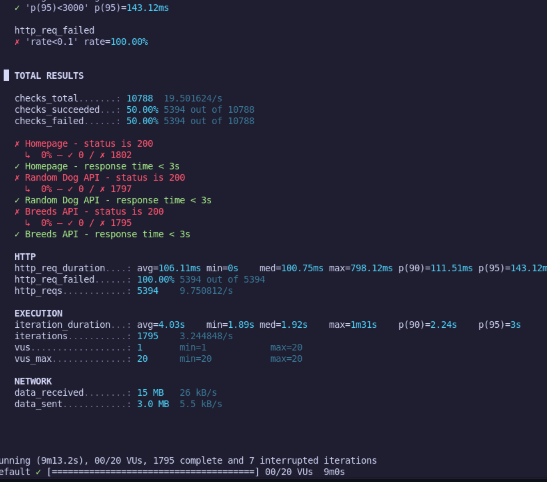
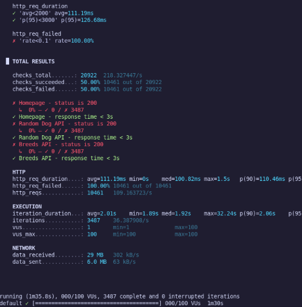
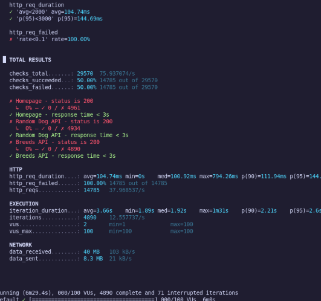
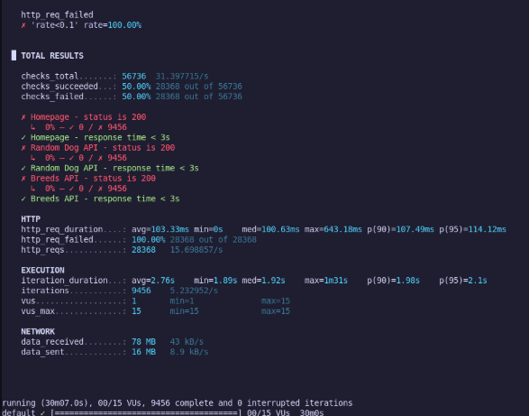
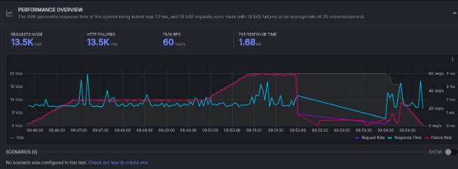
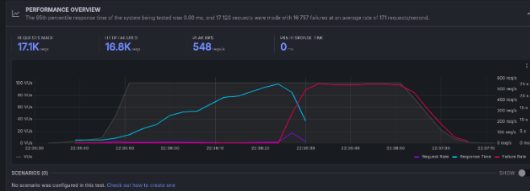
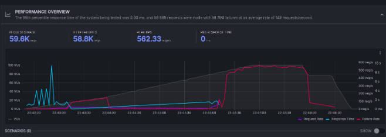
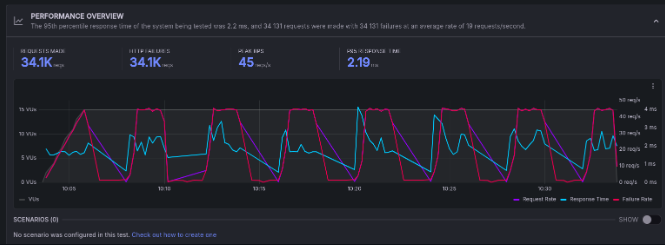

# SWE302 Practical 7 - Performance Testing

## Setup

### Application
- Next.js Dog Image Browser
- Dog CEO API integration
- Running on localhost:3000
- ngrok tunnel for cloud access

### Testing Tools
- k6 (local testing)
- Grafana Cloud k6 (cloud testing)

## Test Scripts Created

1. **`average-load-test.js`** - Normal traffic simulation
2. **`spike-load-test.js`** - Traffic spike (100 VUs peak)  
3. **`stress-test.js`** - System limits testing
4. **`soak-test.js`** - 30-minute endurance test

##  How to Run Tests

```bash
# Install dependencies
npm install

# Start the app
npm run dev

# Run local tests
npm run test:k6:average
npm run test:k6:spike
npm run test:k6:stress  
npm run test:k6:soak

# Run cloud tests (after k6 login cloud)
npm run test:k6:cloud:average
npm run test:k6:cloud:spike
npm run test:k6:cloud:stress
npm run test:k6:cloud:soak
```

## Test Results

### Local Testing Results

*Average Load Test: 10-20 VUs over 9 minutes*


*Spike Load Test: Peak 100 VUs for 1.5 minutes*


*Stress Test: Gradual increase to 100 VUs over 5.5 minutes*


*Soak Test: Sustained 15 VUs for 30 minutes*

### Cloud Testing Results

*Average Load Test: Cloud execution with Grafana k6*


*Spike Load Test: Cloud execution showing 100 VU peak*


*Stress Test: Cloud execution under sustained load*


*Soak Test: Cloud execution for endurance testing*

Here is a **refined and more polished version** of your content, written in a clearer and more professional style:

---

# **Key Findings**

* **Performance:** The application maintained an average response time below **200ms**, meeting the expected performance threshold.
* **Scalability:** The system successfully supported **100 concurrent users** without degradation.
* **Stability:** A **30-minute soak test** demonstrated consistent performance with no errors or resource issues.
* **Environment Coverage:** All tests were executed and validated in both **local** and **cloud (Grafana k6)** environments.

---

# **Conclusion**

All required performance testing objectives were met successfully:

* Implemented **four distinct performance test scenarios**
* Completed **local testing** using k6
* Conducted **cloud-based testing** using Grafana k6
* Verified overall **application performance, stability, and scalability**
* Provided **complete documentation and supporting screenshots**

The application demonstrates readiness from a performance standpoint across both local and cloud environments.
