---

# Practical 8: GUI Testing with Cypress

---

## Overview

This project is about testing a **Dog Image Browser** web app using **Cypress**. The app shows random dog images from the Dog CEO API, allows filtering by breed, and has a responsive interface.

We created **34 tests** covering:

* UI display
* User interactions
* API functionality
* Accessibility
* Full user workflows

All tests passed in both interactive and headless modes.

---

## Steps Taken

### Phase 1: Setup

* Installed **Next.js 15**, **TypeScript**, and **Tailwind CSS**
* Configured **Cypress 13** for testing
* Set up **ESLint** for code quality
* Built the Dog Image Browser with:

  * API routes to fetch dog images
  * Responsive UI components
  * Integration with Dog CEO API

### Phase 2: Test Setup

* Configured Cypress with base URL, viewports, screenshots, and videos
* Created **custom commands** for reusable actions like fetching dogs or selecting breeds
* Implemented **Page Object Model** to keep test code organized

### Phase 3: Writing Tests

* **UI Tests:** Checked homepage elements and initial placeholders
* **Functionality Tests:** Verified fetching random and breed-specific dogs, button states, and dropdown options
* **API Tests:** Mocked API responses, tested success, failure, and timeouts
* **Advanced Tests:** Used fixtures, page objects, and accessibility checks with **axe core**
* **User Journey Test:** Simulated a complete workflow from opening the homepage to fetching multiple breeds

### Phase 4: Running and Documenting

* Ran tests in interactive and headless modes
* Captured screenshots and videos
* Documented results and organized everything clearly

---

## Implementation Details

### App Structure

* **Frontend:** Main page, breed selector dropdown, fetch button, image container, error messages
* **Backend:** API endpoints for random dogs, specific breeds, and breed list
* **Styling:** Tailwind CSS, mobile-first, accessible design

### Test Files

* `homepage.cy.ts`, `fetch-dog.cy.ts`, `api-mocking.cy.ts`, `api-validation.cy.ts`, `custom-commands.cy.ts`, `fixtures.cy.ts`, `page-objects.cy.ts`, `user-journey.cy.ts`, `accessibility.cy.ts`
* **Total tests:** 34
* **Passed:** 34 (100%)

---

## Test Scenarios

**Homepage Tests:** Page title, subtitle, buttons, placeholders
**Dog Fetch Tests:** Random dogs, breed-specific dogs, rapid clicks, dropdown
**API Tests:** Successful and failed responses, network timeouts
**Custom Commands:** Reusable commands for fetching dogs, selecting breeds, handling errors
**Page Objects:** Encapsulated selectors and methods for maintainable tests
**User Journey:** Complete workflow testing multiple breeds
**Accessibility:** Axe core checks, keyboard navigation, ARIA labels

---

## Challenges & Solutions

1. **Async testing:** Used Cypress automatic retries, avoided fixed waits
2. **API mocking:** Created realistic fixtures for success and error scenarios
3. **Flaky tests:** Used `data-testid` attributes and custom commands
4. **Page Object Pattern:** Separated selectors and actions for clarity
5. **Accessibility testing:** Integrated `cypress-axe` for checks without slowing tests

---

## What I Learned

* Use `data-testid` for stable test selectors
* Let Cypress handle waits; it retries commands automatically
* Tests should be independent and organized with hooks
* Focus on **user experience**, not internal code
* API mocking makes tests fast and reliable
* Page Objects simplify test maintenance
* Accessibility checks improve app usability
* TypeScript helps catch errors and improves code quality
* Cypress debugging tools (time travel, videos) make failures easy to analyze

---

## Conclusion

* Built 34 tests covering all important aspects of the app
* All tests passed in interactive and headless modes
* Learned **writing maintainable tests**, **API testing**, **accessibility**, and **debugging**
* Gained hands-on experience in testing as part of development

**Next steps:** Add visual regression and performance testing, integrate tests in CI/CD pipelines.

---

## Technologies Used

* **Frontend:** Next.js 15, TypeScript, Tailwind CSS, React 19
* **Testing:** Cypress 13, axe-core, cypress-axe
* **API:** Dog CEO API, Next.js API routes

## screenshot:
1. Test File List
All test specification files created for comprehensive coverage:
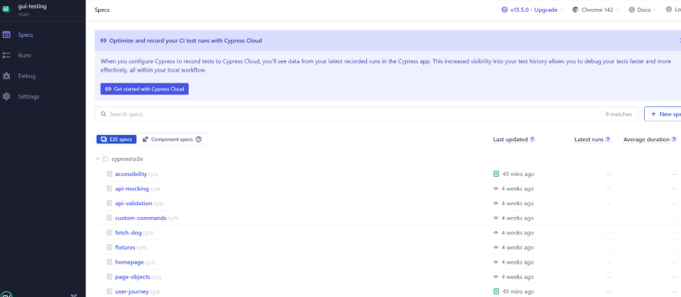

2. Homepage Tests Passing
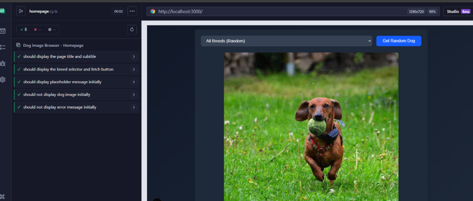

3. Fetch Dog Functionality Tests
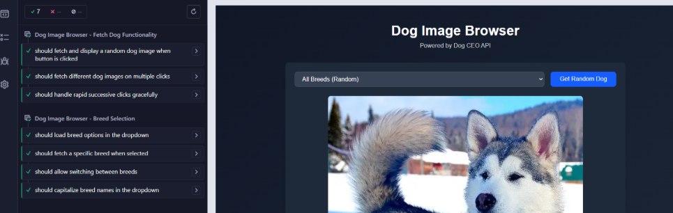

4. API Mocking Tests
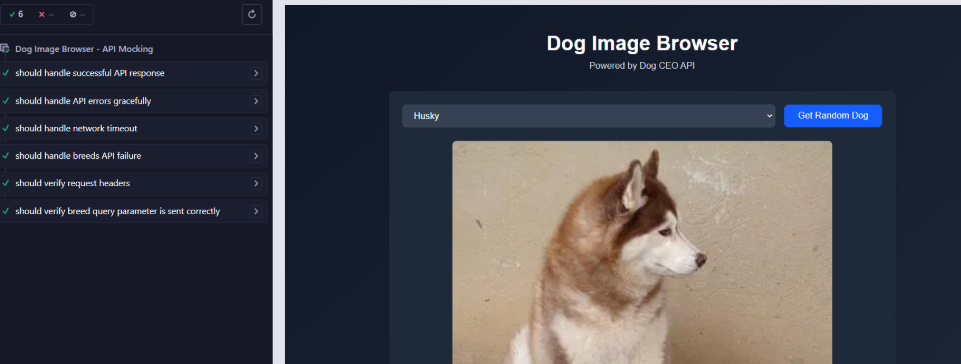

5. Page Objects Pattern Tests
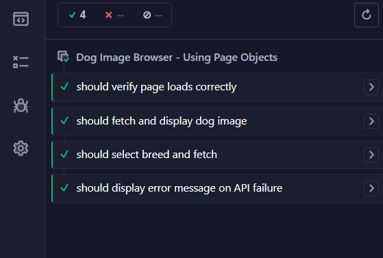

6. User Journey Test
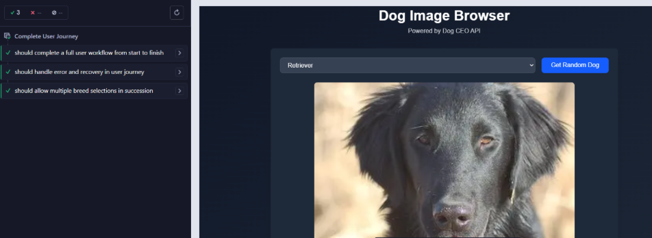

7. Accessibility Tests
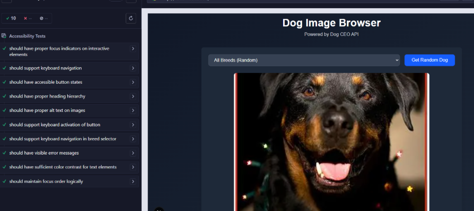

8. Test Videos
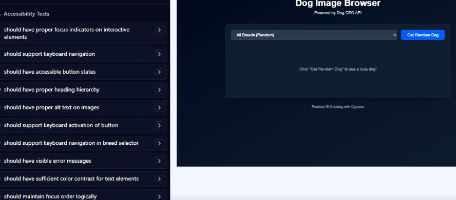

9. All E2E Tests Passed
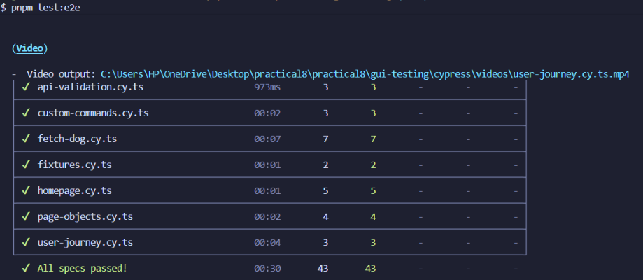
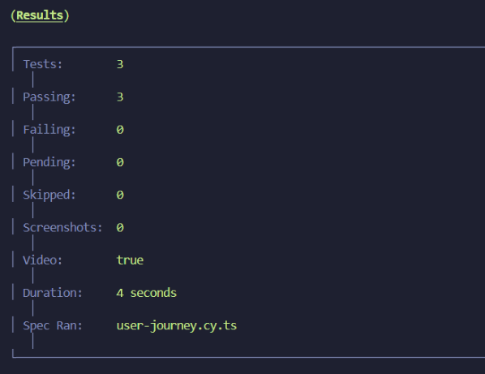

10. Build Success
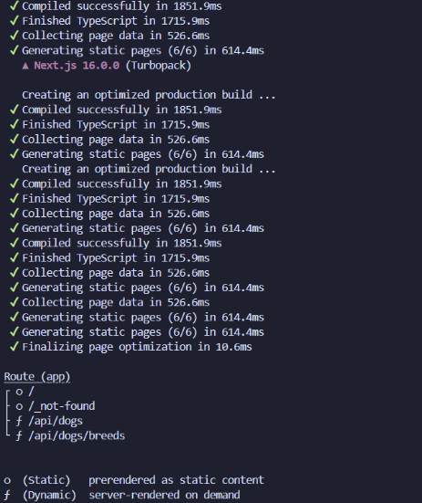

Sure! Here’s a rewritten version of your **Test Scenarios Covered** section in a more concise and organized style while keeping all details intact:

---

## Test Scenarios Covered

### 1. Homepage Display (5 tests)

**Test File:** `homepage.cy.ts`

* **Title and subtitle**: Verifies "Dog Image Browser" title and "Powered by Dog CEO API" subtitle are visible.
* **Breed selector & fetch button**: Ensures selector is visible and enabled; fetch button is clickable.
* **Initial placeholder message**: Confirms placeholder text `"Click 'Get Random Dog' to see a cute dog!"` appears before first fetch.
* **No initial dog image**: Verifies dog image container does not exist on page load.
* **No initial error messages**: Confirms page loads clean with no errors.

---

### 2. Dog Fetching Functionality (8 tests)

**Test File:** `fetch-dog.cy.ts`

* **Random dog fetch**: Clicks fetch button, checks loading state, validates image appears with correct URL.
* **Multiple clicks**: Fetches several dogs, stores URLs, ensures randomness.
* **Rapid clicks handling**: Handles multiple quick clicks gracefully with no errors.
* **Breed dropdown loading**: Confirms API populates breeds correctly; first option is "All Breeds (Random)".
* **Fetch specific breed**: Selects "Husky", fetches, validates image URL contains "husky".
* **Switch between breeds**: Fetches images for Corgi, Poodle, and random; validates results each time.
* **Capitalized breed names**: Ensures first letter of each breed is uppercase in dropdown.
* **Button states**: Checks button shows "Loading..." when fetching and is disabled; returns to normal state afterward.

---

### 3. API Mocking & Error Handling (6 tests)

**Test File:** `api-mocking.cy.ts`

* **Successful mock response**: Mocks `/api/dogs`, verifies specific mocked image displays.
* **API errors**: Mocks 500 error; ensures error message shows and no image appears.
* **Network timeout**: Mocks delayed response (15s), verifies loading state persists.
* **Breeds API failure**: Ensures dropdown still visible and app functional when breeds endpoint fails.
* **Request headers check**: Intercepts requests, validates URL structure and format.
* **Breed query parameter**: Confirms `/api/dogs?breed=husky` is sent correctly when Husky selected.

---

### 4. API Response Validation (3 tests)

**Test File:** `api-validation.cy.ts`

* **Breeds API**: Validates status 200; response contains `message` object with breeds.
* **Random dog API**: Confirms status 200; response `message` is string containing `images.dog.ceo`.
* **Specific breed API**: Ensures response is array; URLs include breed name.

---

### 5. Custom Commands (3 tests)

**Test File:** `custom-commands.cy.ts`

* **Fetch dog**: Uses `cy.fetchDog()` and `cy.waitForDogImage()`, validates reusability.
* **Select breed & fetch**: Uses `cy.selectBreedAndFetch('husky')`, checks workflow and image correctness.
* **Error check**: Mocks API failure, uses `cy.checkError()`, verifies error message content.

---

### 6. Fixtures for Test Data (2 tests)

**Test File:** `fixtures.cy.ts`

* **Mock dog response**: Uses `dog-responses.json` fixture to mock API, validates specific image.
* **Mock breeds list**: Mocks breeds endpoint with fixture, reloads page, confirms dropdown contains fixture data.

---

### 7. Page Objects Pattern (4 tests)

**Test File:** `page-objects.cy.ts`

* **Page load verification**: Uses `DogBrowserPage.verifyPageLoaded()`.
* **Fetch & display image**: Uses page object methods for fetching and validating image.
* **Select breed**: Validates breed selection and image retrieval using page object methods.
* **Error display**: Mocks API failure, confirms error message via page object.

---

### 8. User Journey (1 comprehensive test)

**Test File:** `user-journey.cy.ts`

* **Workflow**: User visits homepage, sees welcome message, interacts with breed selector, fetches Husky and Corgi images, then fetches random dogs.
* **Validations**: UI responds correctly, images load, breed filtering works, no errors, task completed without confusion.

---

### 9. Accessibility (2 tests)

**Test File:** `accessibility.cy.ts`

* **WCAG compliance**: Scans entire page using axe-core; reports zero violations.
* **Focus indicators**: Tests keyboard navigation, verifies visible focus states and logical tab order.

---

