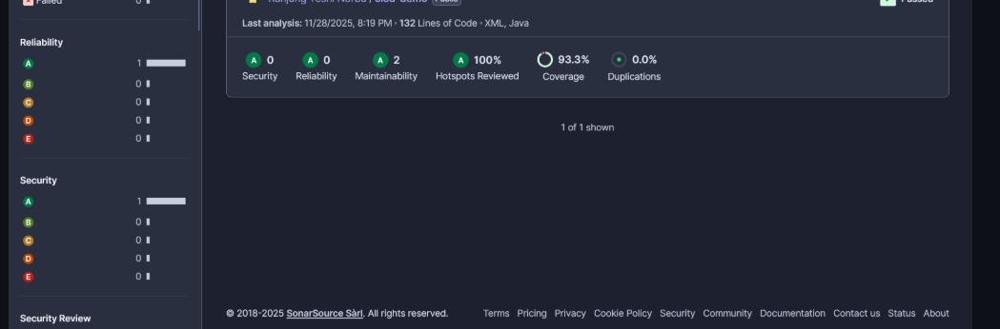
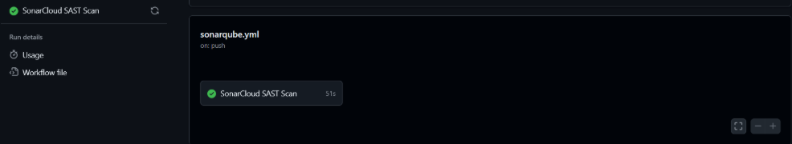
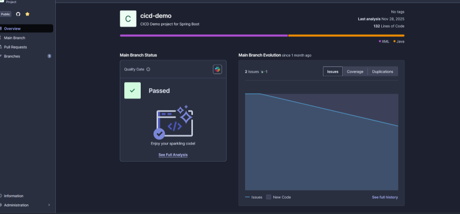

# (Practical 4a – SonarCloud SAST Setup)*

**Project: Setting up Static Application Security Testing (SAST) with SonarCloud in GitHub Actions**

## What I Did

I implemented Static Application Security Testing (SAST) for the *cicd_demo1* project using **SonarCloud** and **GitHub Actions**. My goal was to automate source code vulnerability scanning inside the CI/CD pipeline.

### **1. Set Up SonarCloud**

* Created and configured a SonarCloud account
* Added my project under the **rynorbu** organization
* Generated a **SONAR_TOKEN**
* Saved the token securely in **GitHub Secrets**

### **2. Created SonarCloud Configuration File**

I added a `sonar-project.properties` file which defines:

* Project key, organization
* Source & test file paths
* Java version
* Coverage report path (JaCoCo)
* Exclusions for test files

### **3. Updated Maven Build (pom.xml)**

I added:

* **SonarCloud Maven scanner plugin**
* **JaCoCo plugin** to generate coverage reports
  This allows Maven to run analysis & produce metrics used by SonarCloud.

### **4. Built a GitHub Actions Workflow (`sonarqube.yml`)**

The workflow performs:

* Code checkout
* JDK 17 setup
* Maven build + tests
* Automatic SonarCloud scanning on:

  * Every push
  * Every pull request

I also added debug steps to verify:

* SONAR_TOKEN secret
* Project structure
* sonar-project.properties visibility

### **5. Fixed Common Issues**

I solved issues related to:

* Wrong project key
* Missing coverage report
* Invalid token
* Workflow path errors

### **6. Monitored Results in SonarCloud**

After successful setup, I viewed:

* Vulnerabilities
* Security hotspots
* Code smells
* Coverage percentage
* Quality gate results
* Branch-by-branch analysis

---

## What I Learned

### **1. Importance of Automated Security (Shift-Left Security)**

SonarCloud catches vulnerabilities **before** deployment, making the project more secure and reducing technical debt.

### **2. Difference Between SAST Tools**

I learned that:

* **SonarCloud** → scans *source code* (SQL injection, hardcoded passwords, logic flaws)
* **Snyk** → scans *dependencies* for known CVEs

Both are needed for complete security coverage.

### **3. How Quality Gates Enforce Standards**

I understood that:

* A build can pass, but quality gate can fail
* Quality gates enforce:

  * Zero new vulnerabilities
  * Required test coverage
  * Reviewed hotspots

### **4. How Code Coverage Works**

Using JaCoCo, I learned:

* How test coverage reports are generated
* How SonarCloud reads XML coverage files
* Why running `mvn clean verify` is required before scanning

### **5. Proper Secrets Management**

I learned:

* Never hardcode tokens
* Always use GitHub Secrets
* Debug workflow steps help verify misconfigurations

### **6. CI/CD Workflow Design**

I understood how to:

* Trigger workflows on push & PR
* Use `fetch-depth: 0` for accurate analysis
* Maintain modular workflows (SonarCloud separate from others)

---

# **🔹 Screenshots (use these labels under images)**

### **1. SonarCloud Dashboard – Overall Project Analysis**

### **2. GitHub Actions – SonarCloud Workflow Execution**

### **3. Branch Analysis / Pull Request Decoration**

---

